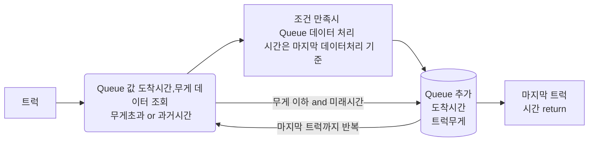

[[백준 문제 연습 : 다리를 지나는 트럭]](https://programmers.co.kr/learn/courses/30/lessons/42583)


---

<div class="mermaid"> 
  graph RL;
A(트럭 출발 )-->B[하중제한 다리];
B-->C(도착);
</div>

```mermaid 
graph RL;
A(트럭 출발 ) -->> B[하중제한 다리];
B -->> C(도착);
```


   큐를 생성에 다리길이만큼 크기에 큐에 들어갈때마다 시간을 측정하고 무게를 더하고 하중보다 초과하면 

큐에 트럭무게대신 0을 넣고 큐에 자료가 빠질때마다 총무게에 빠져나간 무게를 빼주면 해결된다.


   그런데, 이문제를 잘 관찰하면 출발할때 우리는 이미 트럭이 언제 도착할지 예측할수 있다!

도착시간 =  현재시간 + 다리길이 +1 이다.

만약 하중제한이 걸리지않는다면 트럭대기열 + 다리길이 일것이다.

그래서 큐에 넣을때마다 시간을 1씩 추가하고  시간과 무게를 함께 넣어줄것이다.

그리고 다음에 넣어줄때마다 큐가 빠져나갈 시간과 무게를 체크한다

이게 가능한이유는 이미 도착시간이 정해져있기 때문에,

관심사는 미뤄졋을때에 빠져나가는 시간을 현재시간으로 생각하면 되기때문이다

또한 과거시간은 고려대상이아니기에 그것도 빼준다.


시간복잡도는 O(2n)




```python
def solution(bridge_length, weight, truck_weights):
    answer = 0

    queue = []

    sum_w = 0    # 다리에 걸리는 하중 

    br_len  = bridge_length #다리길이

    time = br_len   #도착시간 

    answer = time


    for t_w in (truck_weights):

        time = time + 1
        sum_w = sum_w + t_w


        while queue and (sum_w> weight or (time-br_len) >= queue[0][0]): 
            ##  하중제한이 걸리거나 현재시간 보다 과거시간일때 큐 빼주기

            tmp = queue.pop(0) # list.pop(0) 시간복잡도 O(n) 하지만 queue라 생각하기 
            sum_w = sum_w - tmp[1]


            time = tmp[0] + br_len #
            ## queue 데이터 처리가 끝나면 트럭이 출발하기 때문에 그시간은 마지막 데이터 시간


        queue.append([time,t_w]) # 큐에 넣는 데이터 도착시간,무게

        


    answer = time
    return answer
```

