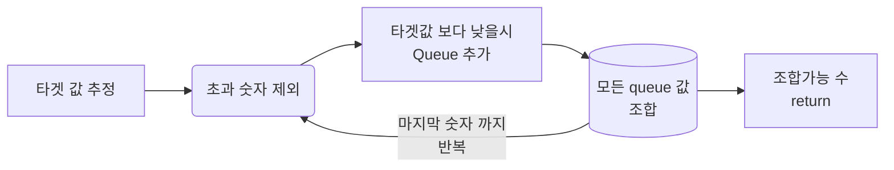

[[프로그래머스 문제 연습 : 타겟넘버]](https://programmers.co.kr/learn/courses/30/lessons/43165)


---




숫자 배열에서 임의로 선택해 목표 값을 만드는 문제이다. 모든 경우의수를 만들어 모두 대조해볼수 있지만 방법을 조금더 좁혀보자.


모든 숫자들 더해서 숫자를 임의로 선택해 빼준다면 선택할수 있는 숫자를 제한할수 있다.

타겟넘버 = 총합  - (선택한숫자합)*2  선택하면 총합에서 제외 되므로 2를 곱해준다.

그럼 우리가 찾아야할건 선택한 숫자합이므로

선택한 숫자합 = (총합 -타겟넘버)/2 이다.

가능한 숫자조합을 좁혔으니 숫자조합 알고리즘을 만들면,

숫자를 골라 선택한숫자합보다 같거나 크다면 제외 단,같을시  제외 하면서 가능한 숫자로 1+

작다면 큐에 넣고  큐에 가능한 숫자와 대조한후 모든 숫자를 반복하면 모든 가능한 경우의 조합 수가 나온다.


만약 숫자배열을 정렬하면 경우의수를 더줄일수 있을거 같다.
   


```python
import collections as col

def solution(numbers, target):
    answer = 0
    
    num_sum = sum(numbers)
    
    num_case = 0

    num_deque = col.deque()  ### deque  BFS
    
    minus_target =  int((num_sum - target)/2)
    
    
    for k in range(len(numbers)):
        
        i = numbers.pop()
        
        if i >= minus_target:
            
            num_case += int(i==minus_target)
            continue
     
        loop = num_deque.copy()
        
        for j in loop:
            
         
            tmp = num_deque.popleft()
            tmp_sum = tmp +i
            num_deque.append(tmp)
            
            
            if tmp_sum < minus_target:
                
                num_deque.append(tmp_sum)
       
                
            elif tmp_sum == minus_target:
                
                num_case += 1
                
        num_deque.append(i)
      
                
    answer = num_case
    return answer
```

